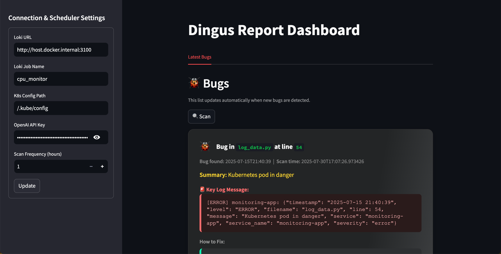
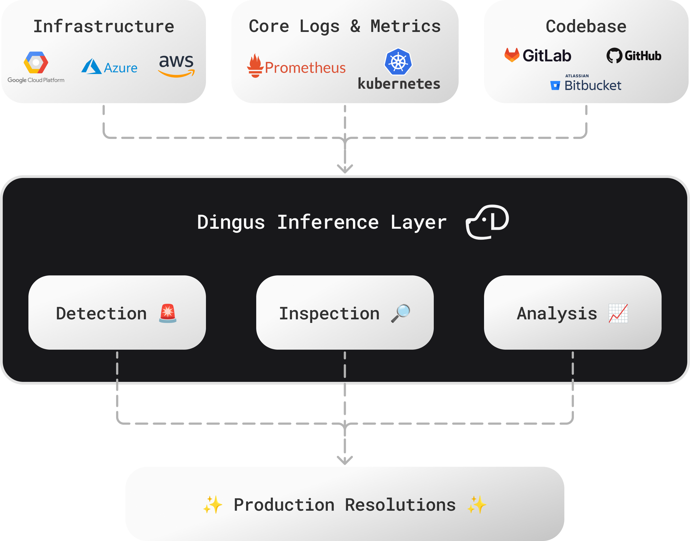

# [Dingus](https://www.dingusai.dev) – Advanced Bug Identification and Debugging



# 📚 Contents

- [Dingus – Advanced Bug Identification and Debugging](#dingus--advanced-bug-identification-and-debugging)
- [📚 Contents](#-contents)
- [Why Developers Use Dingus](#why-developers-use-dingus)
  - [Workflows That Just Flow – Connect the in Dots Seconds, Not Hours](#workflows-that-just-flow--connect-the-in-dots-seconds-not-hours)
- [🛠️ Setup Guide](#️-setup-guide)
    - [Helm](#helm)
    - [Running on Mac (Colima Recommended)](#running-on-mac-colima-recommended)
  - [🐳 Run Dingus with Docker](#-run-dingus-with-docker)
      - [Build \& Start](#build--start)
    - [✅ Development: Run Code Checks](#-development-run-code-checks)
      - [Docker Hub and Helm Deployment](#docker-hub-and-helm-deployment)


# Why Developers Use Dingus
Dingus is a tool to gather critical insights and recommend fixes, making it easier and faster to resolve production issues. Instead of drowning in dashboards and grepping through logs, Dingus automatically:

* Surfaces the issues that actually matter.
* Traces them back to the root.
* Suggests practical fixes you can apply immediately.

Dingus reviews logs, metrics, code, commits and more in order to build a holistic view of what casued a production issue.

* **Zero guesswork** → Know *what* broke and *where* in minutes, not hours.
* **Context-rich insights** → See errors in the bigger picture of your system.
* **Faster debugging** → Jump straight from anomalies to fixes.

If you’ve ever burned a day chasing a production bug that turned out to be something trivial, Dingus was built for you.

## Workflows That Just Flow – Connect the in Dots Seconds, Not Hours
We don’t believe in replacing your existing tools. Instead, we integrate with them to create a seamless experience. Our goal is to help you resolve issues faster by providing the right information and suggesting effective fixes.



# 🛠️ Setup Guide

### Helm
```bash
helm repo add dingus https://dingus-technology.github.io/DINGUS
helm install dingus dingus/dingus
```

Port-forward the UI:
```bash
kubectl port-forward svc/dingus-dingus 8501:8501 
```

### Running on Mac (Colima Recommended)

On macOS, use [Colima](https://github.com/abiosoft/colima) for reduced overhead compared to Docker Desktop:

```bash
colima start
```

## 🐳 Run Dingus with Docker

First clone this repository, then for Dingus to observe your K8s cluster, place your kube config in the top-level directory:

```bash
DINGUS/.kube/config
```

#### Build & Start

Spin everything up in one step:

```bash
docker compose up --build
```

Once running, open [http://0.0.0.0:8501/](http://0.0.0.0:8501/) and add your configs.

👉 No production logs handy? Try our [simulation repo](https://github.com/dingus-technology/INFRASTRUCTURE-SIMULATION) to generate fake logs locally.

> **Note:** Not on MacOS? Replace `http://host.docker.internal` with your host machine’s local IP in `DINGUS/docker-compose`.


### ✅ Development: Run Code Checks

Keep the codebase clean and consistent:

```bash
docker compose exec dingus bash
```

Then run:

```bash
format-checks
code-checks
```

#### Docker Hub and Helm Deployment

To push a new image to Docker Hub use:
```bash
docker build -t dingusai/dingus:latest .;
docker login;
docker push dingusai/dingus:latest;
```
Optional: run locally with `docker run dingusai/dingus:latest`

Then create the Helm package:

```bash
helm package dingus-chart/
```

Optional: Install the code locally `helm install dingus dingus-chart/`