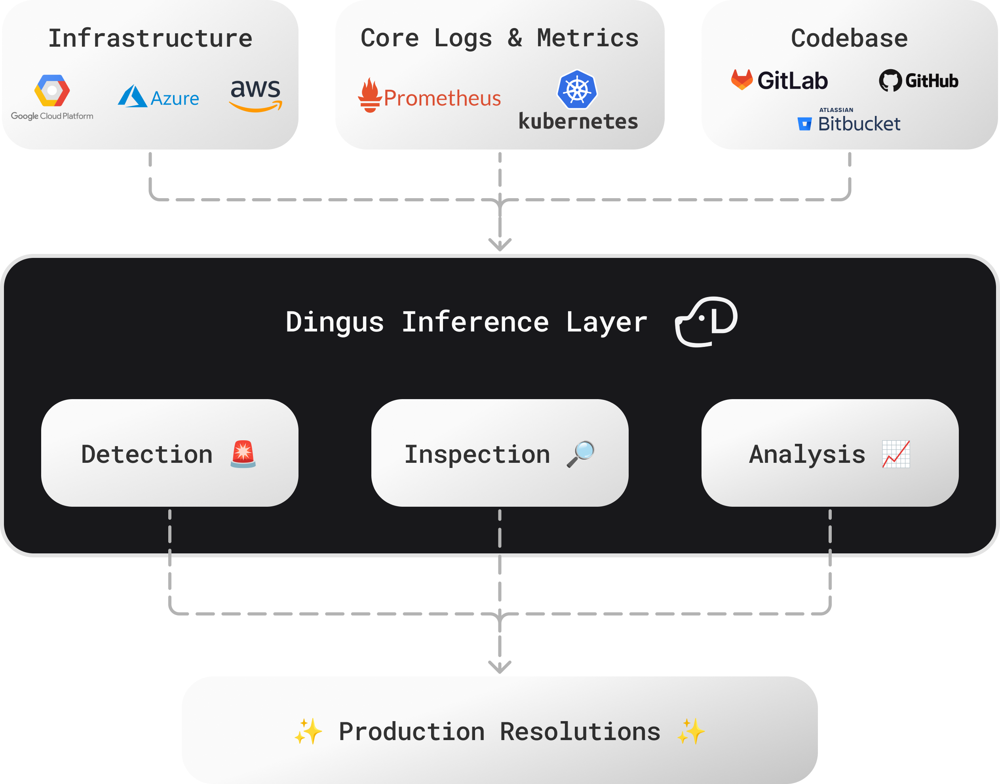

# [Dingus](https://www.dingusai.dev) – Advanced Bug Identification and Debugging


# 🛠️ Setup Guide

### Helm
```bash
helm repo add dingus https://dingus-technology.github.io/DINGUS
helm install dingus dingus/dingus
```

Port-forward the UI:
```bash
kubectl port-forward svc/dingus-dingus 8501:8501 
```

# Why Developers Use Dingus
Dingus is a tool to gather critical insights and recommend fixes, making it easier and faster to resolve production issues. Instead of drowning in dashboards and grepping through logs, Dingus automatically:

* Surfaces the issues that actually matter.
* Traces them back to the root.
* Suggests practical fixes you can apply immediately.

Dingus reviews logs, metrics, code, commits and more in order to build a holistic view of what casued a production issue.

* **Zero guesswork** → Know *what* broke and *where* in minutes, not hours.
* **Context-rich insights** → See errors in the bigger picture of your system.
* **Faster debugging** → Jump straight from anomalies to fixes.

If you’ve ever burned a day chasing a production bug that turned out to be something trivial, Dingus was built for you.

## Workflows That Just Flow – Connect the in Dots Seconds, Not Hours
We don’t believe in replacing your existing tools. Instead, we integrate with them to create a seamless experience. Our goal is to help you resolve issues faster by providing the right information and suggesting effective fixes.


